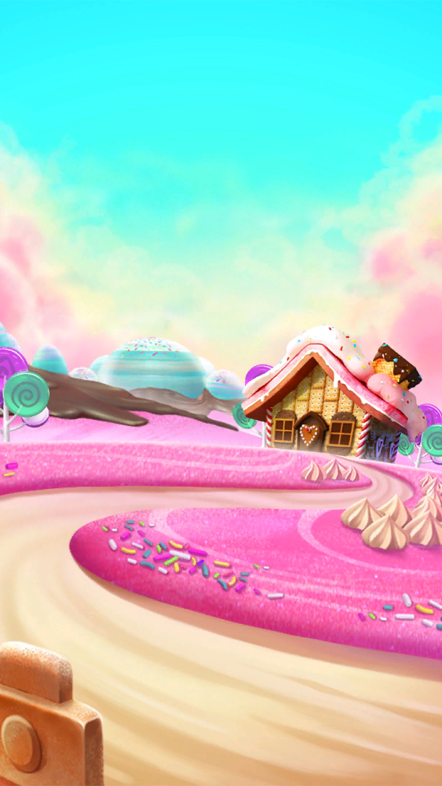

# Three-in-Row 🟡🟣🔴

A modern “match-3” written in **Python 3 + PyQt5** with full network play.  
Everything you see on screen is driven by the same server‑side game logic, so every
player is always on the exact same board.

<p align="center">
  
  <br><em>VS‑mode · rocket&nbsp;&amp;&nbsp;bomb bonuses, score &amp; timer, per‑cell animations</em>
</p>

---

## ✨ Features

|                           |                                                                                         |
|---------------------------|-----------------------------------------------------------------------------------------|
| **Two multiplayer modes** | *Time mode* — 3‑minute duel on two independent boards.<br>*Chess mode* — one shared board, strict turn order. |
| **Bonuses**               | 4‑in‑a‑row → horizontal / vertical rocket.<br>5 + ‑in‑a‑row → bomb (3 × 3 splash). |
| **Authoritative server**  | The server is the only place where the board mutates.<br>Clients only receive snapshots/patches & animate them. |
| **Smooth UX**             | 60 fps tile swap, gravity, bonus explosions, sound FX.<br>Input automatically blocked while it isn’t your turn. |
| **JSON protocol**         | Pure UTF‑8 JSON over TCP/WS – easy to replay or integrate with bots. |

---

## 📦 Installation

```bash
git clone https://github.com/your-nick/three-in-row.git
cd three-in-row
python -m venv venv
source venv/bin/activate      # Windows: venv\Scripts\activate
pip install -r requirements.txt
```

`requirements.txt`

```
PyQt5-Qt5>=5.15
PyQt5-sip
PyQt5
```

---

## 🚀 Running

### Solo (local board, no networking)

```bash
python app.py
```

---

## 🗄️ Project layout

```
core/
 ├─ board.py          ← pure game logic (no PyQt)
 ├─ enums.py          ← Color / Bonus enums
 ├─ protocol.py       ← JSON helpers
 ├─ server.py         ← asyncio authoritative server
GUI/
 ├─ game_window.py    ← PyQt widgets & animations
 ├─ explosion_label.py
 ├─ settings_window.py
assets/               ← png sprites & sounds
docs/                 ← screenshots / gifs
```

---

## 🔗 Protocol cheat‑sheet

<details>
<summary>start_game</summary>

```json
{
  "command": "start_game",
  "mode": "chess",                     // or "time"
  "queue_players": ["Alice","Bob"],
  "current_player": "Alice",
  "nicknames": ["Alice","Bob"],
  "board": [["o","p","r", ... ], ...], // 8×7 matrix
  "seconds": 180                       // remaining time for time‑mode
}
```
</details>

<details>
<summary>swap_result</summary>

```json
{
  "command": "swap_result",
  "removed": [[4,1],[4,2],[4,3]],      // cells that disappeared
  "bonuses": [
    {"r":4,"c":3,"bonus":"BOMB"}
  ],
  "fallen": [
    {"elem":{"x":2,"y":3,"color":"red","bonus":"NONE"},
     "new_r":3,"new_c":3}
  ],
  "spawned": [
    {"x":0,"y":2,"color":"orange","bonus":"NONE"}
  ],
  "board": [...],                      // fresh 8×7 matrix
  "next_player": "Bob",
  "score": 37
}
```
</details>

The client never tries to **deduce** anything – it just animates exactly what
came from the server.

---

## 📜 License

MIT © 2025 Your Name
